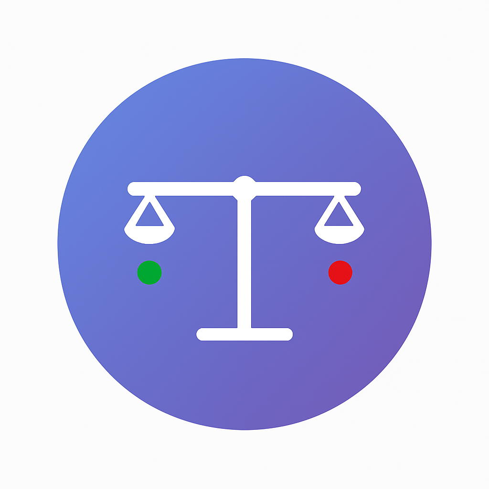

# ⚖️ Manual Background Removal Evaluator App

  

  
  **Background Removal Quality Assessment Tool**
  
  

## 💬 About

Manual Background Removal Evaluator is a Streamlit web application for assessing AI-generated background removal results for production readiness using a 5-point evaluation rubric system. This tool enables human annotators to validate the quality of background-removed images by comparing the original and processed versions side by side. Annotators score each image using a well-defined 5-point rubric, ensuring consistent and objective assessment. At the end of the evaluation, users receive a summary dashboard with an executive summary of the results, average score, and rating distributions to inform product decisions.

### ⚖️ Rating Scale
- **1 - Unusable**: Major issues with structure, style, identity, or overall quality. Not suitable for use.
- **2 - Partially Viable**: Useful as a concept or direction, but not for final use. Significant fixes required.
- **3 - Moderately Functional**: Largely usable, with moderate fixes needed. More efficient than starting from scratch.
- **4 - Near Production Ready**: Only minor adjustments needed, such as light cleanup or retouching.
- **5 - Production Ready**: No further edits needed. Ready for immediate use.
  
### ✨ Features
- **Professional Assessment**: Rate images from 1-5 rubric criteria above. 
- **Interactive Interface**: Side-by-side comparison views
- **Comprehensive Analytics**: Detailed evaluation reports and statistics
- **Mobile Friendly**: Works seamlessly across all devices

## 🔗 Quick Start

1. **Open the App: https://background-removal-evaluator-8qmjiykauk7sjauwsnjskj.streamlit.app/)**
2. **Review the criteria** 
3. **Evaluate images** using the 5-point scale
4. **View analysis** when complete

---
