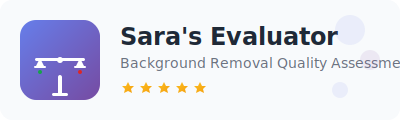

# ⚖️ Sara's Enterprise Background Removal Evaluator

  
  
  **AI Background Removal Quality Assessment Tool**
  
  

## 💬 About

Assess AI-generated background removal results for production readiness with our comprehensive 5-point evaluation system.

### ✨ Features
- **Professional Assessment**: Rate images from 1-5 based on edge quality, artifact removal, and professional appearance
- **Interactive Interface**: Side-by-side comparison views
- **Comprehensive Analytics**: Detailed evaluation reports and statistics
- **Mobile Friendly**: Works seamlessly across all devices

### ⚖️ Rating Scale
- **1 - Unusable**: Major issues, not suitable for use
- **2 - Partially Viable**: Significant fixes required
- **3 - Moderately Functional**: Moderate fixes needed
- **4 - Near Production Ready**: Minor adjustments needed
- **5 - Production Ready**: Ready for immediate use

## 🔗 Quick Start

1. **[Open the App]([your-streamlit-app-url-here](https://background-removal-evaluator-8qmjiykauk7sjauwsnjskj.streamlit.app/)**
2. **Review the criteria** on the landing page
3. **Evaluate images** using the 5-point scale
4. **View analysis** when complete

---
